# Healper——心理咨询平台

|  学号   | 姓名 | 贡献 |
| :-----: | :--: | :--: |
| 2054164 | 刘畅 | 100% |

- [1. 项目介绍](#1-项目介绍)
  - [1.1. 项目背景](#11-项目背景)
  - [1.2. 整体描述](#12-整体描述)
  - [1.3. 功能介绍](#13-功能介绍)
    - [1.3.1. 登录注册](#131-登录注册)
    - [1.3.2. 心理测评](#132-心理测评)
    - [1.3.3. 用户信息](#133-用户信息)
    - [1.3.4. 心理咨询](#134-心理咨询)
  - [1.4. 项目界面](#14-项目界面)
    - [1.4.1. 登录注册界面](#141-登录注册界面)
    - [1.4.2. 心理测评界面](#142-心理测评界面)
    - [1.4.3. 用户信息界面](#143-用户信息界面)
    - [1.4.4. 心理咨询界面](#144-心理咨询界面)
    - [1.4.5. 咨询师界面](#145-咨询师界面)
- [2. 项目结构](#2-项目结构)
  - [2.1. 开发架构](#21-开发架构)
  - [2.2. .NET Core项目结构](#22-net-core项目结构)
  - [2.3. 数据存储模型](#23-数据存储模型)
  - [2.4. 逻辑设计](#24-逻辑设计)
  - [2.5. 物理设计](#25-物理设计)
- [3. 后端开发](#3-后端开发)
  - [3.1. ORM映射](#31-orm映射)
  - [3.2. Controller写法](#32-controller写法)
    - [3.2.1. 数据封装](#321-数据封装)
    - [3.2.2. 依赖注入](#322-依赖注入)
  - [3.3. Service写法](#33-service写法)
    - [3.3.1. 接口和实现](#331-接口和实现)
    - [3.3.2. 数据库操作](#332-数据库操作)
  - [3.4. 调用C++动态链接库](#34-调用c动态链接库)
  - [3.5. 调用CLR类库](#35-调用clr类库)


# 1. 项目介绍

## 1.1. 项目背景

​	中国精神分析大会的报告显示，我国有超43万的心理咨询师人才缺口，心理咨询似乎一直是个小众的职业。如今社会发展迅速，精神心理方面得到大家的重视，越来越多的人愿意花钱去咨询心理问题，然而咨询师并非一个非常轻松的职业，每个来访者可能都需要多次反复的咨询和治疗，还需要对每个来访者进行档案整理，并制定针对性的方案。因此，本团队致力于开发一个心理咨询辅助系统，为咨询师和来访者提供便利。

## 1.2. 整体描述

1. 平台提供多种优质心理测评试题，并附带结果分析报告，便于让用户更加深入地了解自己的心理状态，咨询师可以以此为参考进行对症下药。
2. 平台提供线上的付费心理咨询的功能，有专业的心理咨询师解答用户的心理问题。
3. 每位来访者配备对应的档案，咨询师可以撰写其负责的来访者档案，帮助管理资料库。
4. 系统可以根据来访者的心理测评情况，包括其各个情绪因子的程度和咨询师的标签，来推荐合适的咨询师匹配。

## 1.3. 功能介绍

### 1.3.1. 登录注册

1. 游客能够通过手机号码登录成来访者身份。
2. 游客能够通过手机号码、在填写个人信息后完成注册成为来访者。
3. 管理员可以创建心理咨询师账号，并分配给对应的咨询师。
4. 对于系统赋权的咨询师和管理员账号，也能通过用户名和密码进行登录。

### 1.3.2. 心理测评

在心理测评系统中，主要完成以下功能需求：

1. 来访者可以选择心理测评量表进行自我心理测评。
2. 心理测评问卷包括客观选择题和主观文字题，每个答案都会影响情绪因子的程度值，并在结果报告中呈现。
   1. 客观题中每个选项对情绪因子的影响是固定的
   2. 主观题的文字答案使用情感分析算法得到情绪因子，并加权到结果分析中。

3. 测评完毕后，可以查看对应的测评结果，并选择是否保存。

### 1.3.3. 用户信息

1. 来访者和心理咨询师可以查看和修改个人信息，包括昵称、手机号、密码、年龄、性别等基本信息。
2. 来访者可以查看、隐藏或删除自己的过往心理测评记录。
3. 来访者可以查看自己的档案。注：档案——来访者的过往心理咨询情况，包括每次的咨询总结。
4. 心理咨询师可以查看自己的咨询历史，并查看其中自己所绑定的来访者信息和档案。
5. 来访者的档案具有保密性，非绑定的咨询师无法查看其档案，除非该咨询师正在与来访者进行咨询。
6. 来访者可以选择某个咨询师申请为专属咨询师，此时咨询师获取查看其档案的权限。

### 1.3.4. 心理咨询

1. 来访者可以选择心理咨询师，在付款后即预约该心理咨询师。
2. 在排队过程中，来访者可以随时放弃预约。
3. 若来访者处于某个咨询师的预约列表中，此时该咨询师可以查看其档案信息。
4. 咨询师可以和预约中的来访者交流，无论是咨询前、咨询中或咨询后，点对点的聊天记录都会得到保存。
5. 咨询师可以点击开始按钮开始咨询，也可以点击结束咨询按钮结束本次咨询。
6. 咨询结束后来访者需要支付咨询费用，若不支付的会被封号。

## 1.4. 项目界面

### 1.4.1. 登录注册界面

1. 登陆：用户可以在此界面输入账号密码进行登录

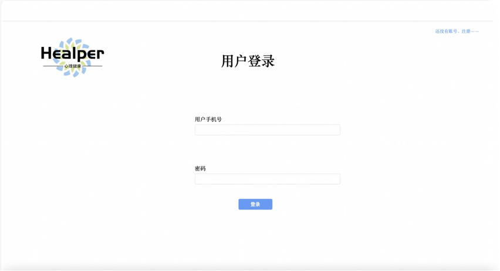

2. 注册：用户可以在此界面注册账号，进行手机验证码等操作

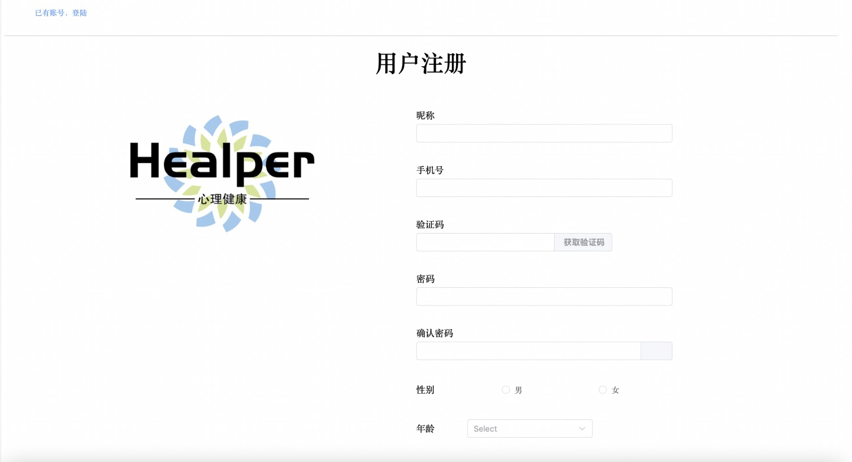

### 1.4.2. 心理测评界面

1. 选择问卷：来访者可以在这里选择相关问卷进行测试

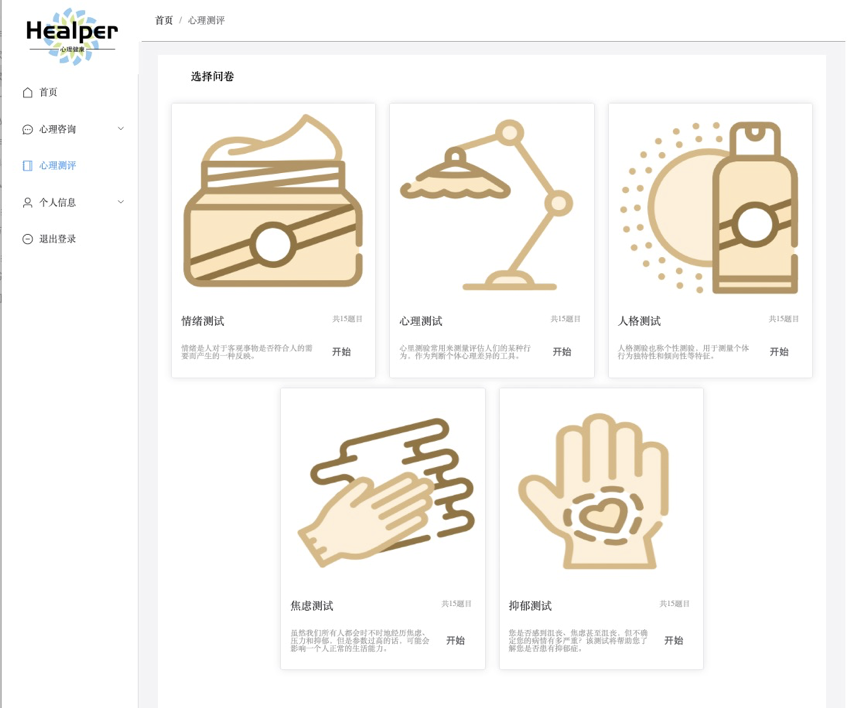

2. 进行测评：来访者进行具体心理量表的填写

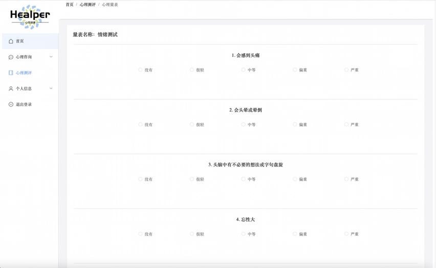

3. 查看报告：来访者查看心理测评报告

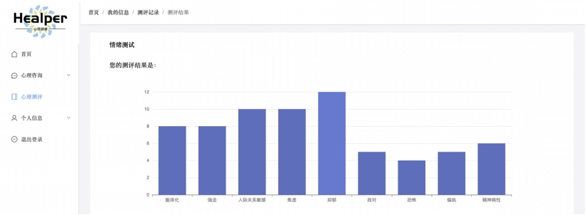

4. 查看统计分析报告

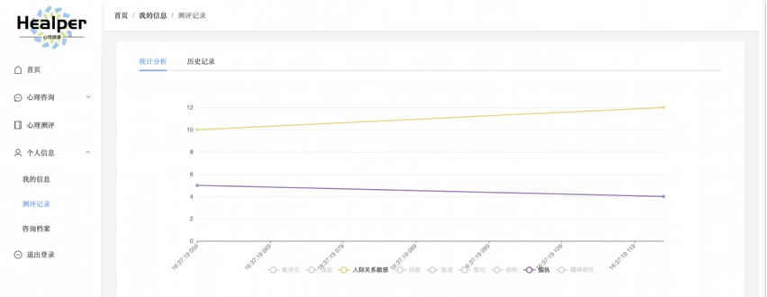

5. 查看心理测评记录

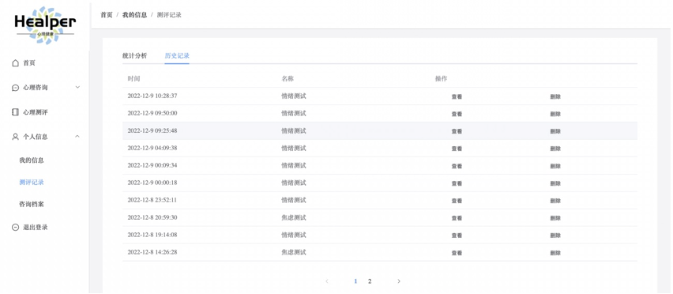

### 1.4.3. 用户信息界面

1. 个人信息页面

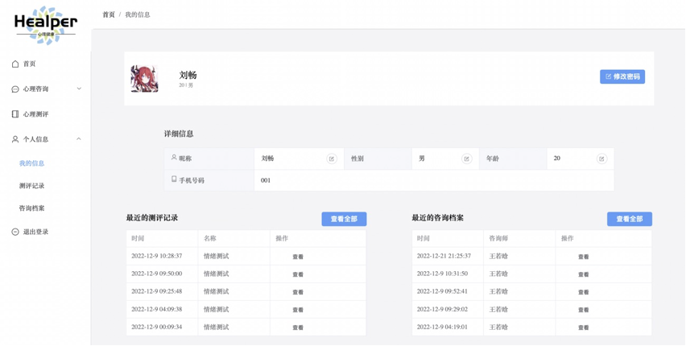

2. 查看个人咨询档案

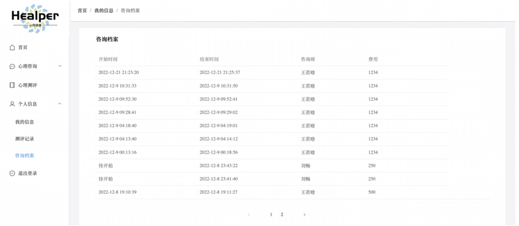

### 1.4.4. 心理咨询界面

1. 首页（包含待开始的咨询、推荐心理量表、推荐咨询师）

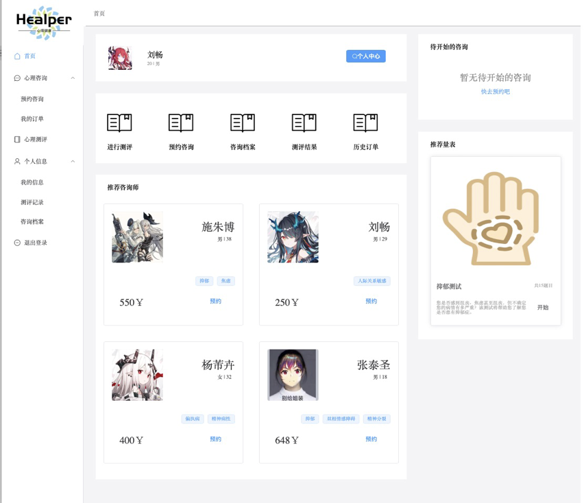

2. 预约咨询推荐

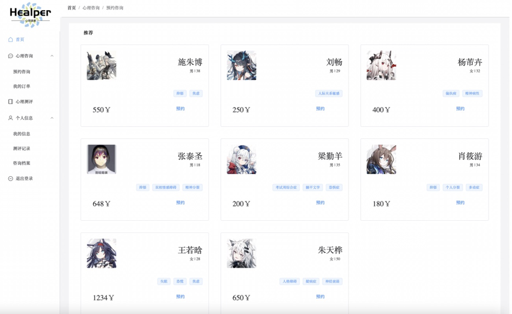

3. 订单历史页面

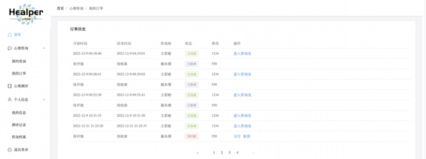

4. 咨询师付款页面

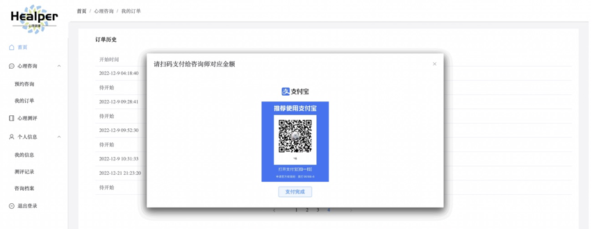

5. 心理咨询聊天页面

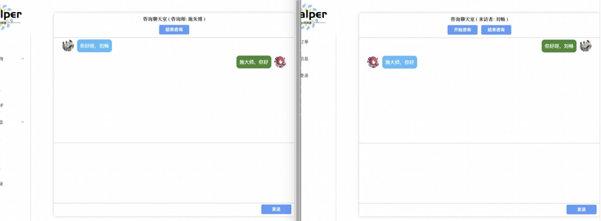

### 1.4.5. 咨询师界面

1. 个人信息界面

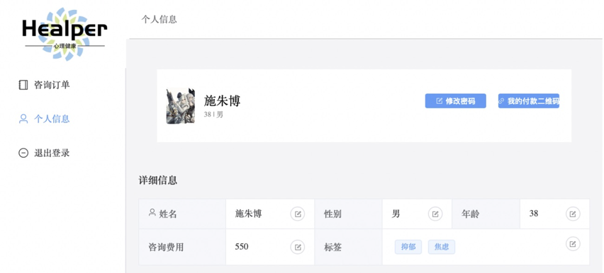

2. 咨询历史界面

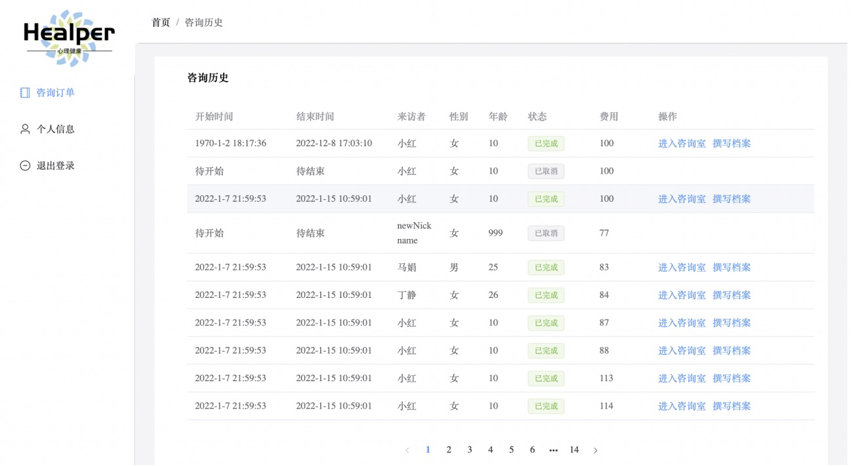

# 2. 项目结构

## 2.1. 开发架构

本项目采用前后端分离架构，前端使用`Vue.js`，后端采用`.NET Core 6.0`，情感分类api采用`flask`框架，数据库采用`Mysql`，具体代码附在压缩包中。

## 2.2. .NET Core项目结构

以下是.NET的目录结构，分为8个程序集，如下：

1. Encryption：使用md5加密字符串
2. EnternalInterfaces：第三方接口程序集，包含Oss、Sms等
3. Healper-BackEnd：项目入口，包含控制器和一些配置文件
4. HealperDto：即data transfer object，用于前后端传输数据
5. HealperModels：Model层和数据访问层
6. HealperResponse：封装接口对前端的返回
7. HealperService：服务层，封装业务逻辑代码
8. SmsCode：随机生成验证码，用于辅助Sms

以下是项目的具体结构：

```
.
├── Encryption
│   ├── Encryption.vcxproj
│   ├── Encryption.vcxproj.filters
│   ├── dllmain.cpp
│   ├── encryption.cpp
│   ├── encryption.h
│   ├── framework.h
│   ├── md5.cpp
│   ├── md5.h
│   ├── pch.cpp
│   └── pch.h
├── ExternalInterfaces
│   ├── ExternalInterfaces.csproj
│   ├── OSSHelp.cs
│   ├── SMSHelp.cs
│   └── StreamHelp.cs
├── Healper-BackEnd
│   ├── Controllers
│   │   ├── ConsultController.cs
│   │   ├── HistoryController.cs
│   │   ├── ScaleController.cs
│   │   └── UserController.cs
│   ├── Healper-BackEnd.csproj
│   ├── Healper-BackEnd.csproj.user
│   ├── Program.cs
│   ├── Properties
│   │   └── launchSettings.json
│   ├── appsettings.Development.json
│   └── appsettings.json
├── Healper-BackEnd.sln
├── HealperDto
│   ├── HealperDto.csproj
│   ├── InDto
│   │   ├── ArchiveInDto.cs
│   │   ├── ConsultRecordInDto.cs
│   │   ├── ConsultTimeInDto.cs
│   │   ├── HistoryStatusInDto.cs
│   │   ├── LoginInfoInDto.cs
│   │   ├── RegisterInfoInDto.cs
│   │   ├── ScaleRecordInDto.cs
│   │   ├── UpdatePasswdInDto.cs
│   │   └── UploadImageInDto.cs
│   └── OutDto
│       ├── Archive.cs
│       ├── ClientInfo.cs
│       ├── ConsultOrder.cs
│       ├── ConsultantInfo.cs
│       ├── ConsultantStatus.cs
│       ├── LoginInfoOutDto.cs
│       ├── ScaleInfo.cs
│       ├── ScaleRecordInfo.cs
│       └── UserType.cs
├── HealperModels
│   ├── HealperModels.csproj
│   ├── ModelContext.cs
│   └── Models
│       ├── ChatMessage.cs
│       ├── Client.cs
│       ├── ConsultHistory.cs
│       ├── Consultant.cs
│       ├── PsychologyScale.cs
│       ├── ScaleRecord.cs
│       └── User.cs
├── HealperResponse
│   ├── HealperResponse.csproj
│   └── ResponseEntity.cs
├── HealperService
│   ├── ConsultService.cs
│   ├── HealperService.csproj
│   ├── HistoryService.cs
│   ├── Impl
│   │   ├── ConsultServiceImpl.cs
│   │   ├── HistoryServiceImpl.cs
│   │   ├── ScaleServiceImpl.cs
│   │   └── UserServiceImpl.cs
│   ├── ScaleService.cs
│   └── UserService.cs
└── SmsCode
    ├── AssemblyInfo.cpp
    ├── Resource.h
    ├── SmsCode.cpp
    ├── SmsCode.h
    ├── SmsCode.vcxproj
    ├── SmsCode.vcxproj.filters
    ├── app.ico
    ├── app.rc
    ├── pch.cpp
    └── pch.h
```

## 2.3. 数据存储模型

## 2.4. 逻辑设计

1. 实体1：来访者

| 实体名称 | 来访者                                                       |
| -------- | ------------------------------------------------------------ |
| 标识符   | Client                                                       |
| 描述     | 产品的主要服务对象                                           |
| 主键     | 来访者ID                                                     |
| 数据项   | 来访者ID，手机号，密码，性别，昵称，问卷记录列表，专属咨询师 |

2. 实体2：咨询师

| 实体名称 | 咨询师                                                       |
| -------- | ------------------------------------------------------------ |
| 标识符   | Consultant                                                   |
| 描述     | 产品的主要使用者                                             |
| 主键     | 咨询师ID                                                     |
| 数据项   | 咨询师ID，手机号，密码，性别，姓名，咨询费，专场标签列表，专属来访者列表 |

2. 实体3：档案

| 实体名称 | 档案                                             |
| -------- | ------------------------------------------------ |
| 标识符   | Archive                                          |
| 描述     | 来访者心理相关的资料记录                         |
| 主键     | 档案ID                                           |
| 数据项   | 档案ID，来访者ID，咨询师ID，撰写日期，总结，建议 |

2. 实体4：订单

| 实体名称 | 订单                                                         |
| -------- | ------------------------------------------------------------ |
| 标识符   | Order                                                        |
| 描述     | 来访者预约咨询师产生的订单，当订单开始后便会生成一条咨询记录 |
| 主键     | 订单ID                                                       |
| 数据项   | 订单ID，订单状态，咨询师ID，来访者ID，预约时间，费用         |

2. 实体5：聊天信息

| 实体名称 | 聊天消息                                   |
| -------- | ------------------------------------------ |
| 标识符   | Message                                    |
| 描述     | 来访者与咨询师咨询时产生的消息             |
| 主键     | 消息ID                                     |
| 数据项   | 消息ID，来访者ID，咨询师ID，发送时间，内容 |

2. 实体6：心理量表

| 实体名称 | 心理量表                               |
| -------- | -------------------------------------- |
| 标识符   | PsyScale                               |
| 描述     | 来访者可以进行自测的心理测评量表       |
| 主键     | 量表ID                                 |
| 数据项   | 量表ID，问题数量，量表名称，内容，简介 |

2. 关系1：咨询记录

| 关系名称 | 咨询记录                                                     |
| -------- | ------------------------------------------------------------ |
| 标识符   | ConsultHistory                                               |
| 描述     | 当正式开始咨询时，订单会转换为咨询记录，咨询记录中会保存聊天记录 |
| 主键     | 记录ID                                                       |
| 数据项   | 记录ID，订单ID，咨询师ID，来访者ID，消息列表，开始时间，持续时间，记录状态 |

2. 关系2：测评记录

| 关系名称 | 测评记录                                                 |
| -------- | -------------------------------------------------------- |
| 标识符   | PsyScaleReport                                           |
| 描述     | 来访者的心理测评记录                                     |
| 主键     | 记录ID                                                   |
| 数据项   | 记录ID，来访者ID，量表类型，测评时间，测评结果，记录状态 |

## 2.5. 物理设计

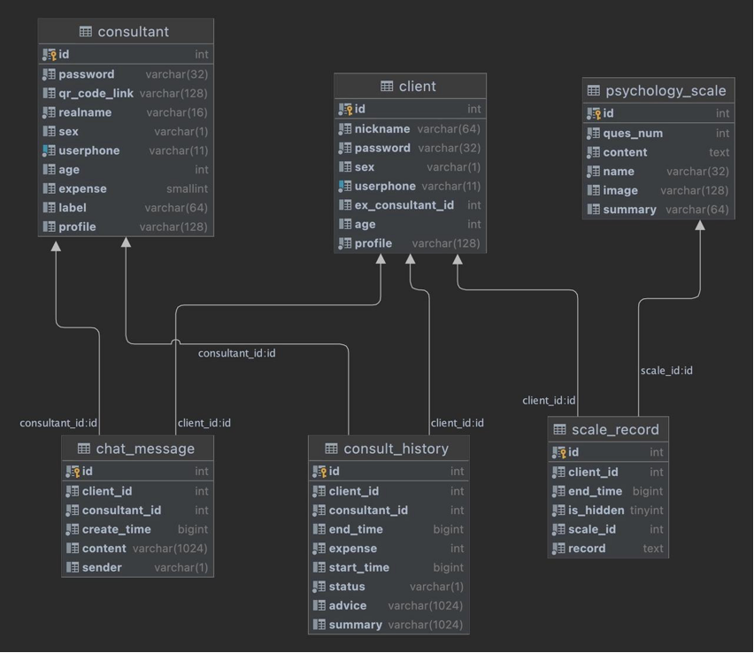

# 3. 后端开发

## 3.1. ORM映射

本项目采用DbFirst开发，即先在数据库中构建表后，将其使用Object-Relation-Map(ORM)技术映射为实体类。在这里使用Entity-Framework-Core框架，并且使用下列命令将表映射为实体类：
```sh
Scaffold-DbContext "Data Source=xx.xx.xx.xx;Database=xxx;Password=xxx;User ID=xxx;" MySql.EntityFrameworkCore -OutputDir Models -context ModelContext -Force
```

上述命令将远端的Mysql表，使用MySql.EntityFrameworkCore中的映射算法，输出到了Models文件夹中，并使用ModelContext这个上下文类来管理，它是一个派生自DbContext的类。DbContext是EF-Core中与底层数据库交互的类，用于管理数据库连接并进行增删改查。

## 3.2. Controller写法

### 3.2.1. 数据封装

项目定义了ResponseEntity用于封装返回给前端的接口，可以在返回时直接指定状态码和实体类。

```C#
public class ResponseEntity
    {
        public static ResponseEntity OK(string msg="")
        {
            return new ResponseEntity(HttpStatusCode.OK, msg);
        }

        public static ResponseEntity ERR(string msg = "")
        {
            return new ResponseEntity(HttpStatusCode.InternalServerError, msg);
        }
        private ResponseEntity(HttpStatusCode statusCode, string msg)
        {
            Code = statusCode;
            Msg = msg;
        }

        public ResponseEntity Body(object data)
        {
            Data = data;
            return this;
        }
        public object? Data { get; set; } = null;

        public HttpStatusCode Code { get; set; }

        public string Msg { get; set; } = "";
    }
```

### 3.2.2. 依赖注入

在Controller之中需要调用Service层的函数，因此选择将Service注入到Controller之中，这里采用构造函数注入法，首先在`Program.cs`中添加Scoped，

```C#
builder.Services.AddScoped<IUserService, UserServiceImpl>();
```

而后在Controller之中写构造函数

```C#
[ApiController]
[Route("api/[controller]")]
public class UserController : ControllerBase
{
  private readonly IUserService myUserService;
	private readonly IScaleService myScaleService;
  
  public UserController(IUserService userService, IScaleService scaleService)
  {
      myUserService = userService;
      myScaleService = scaleService;
  }
}
```

## 3.3. Service写法

### 3.3.1. 接口和实现

在Service层定义接口的目的是为了抽象出业务逻辑的功能，使其他模块能够通过接口进行调用，而不需要了解具体的实现细节，满足松耦合、可替换性等特性，因此Service层的代码结构如下：
```
├── HealperService.csproj
├── ConsultService.cs
├── HistoryService.cs
├── ScaleService.cs
├── UserService.cs
├── Impl
│   ├── ConsultServiceImpl.cs
│   ├── HistoryServiceImpl.cs
│   ├── ScaleServiceImpl.cs
└── └── UserServiceImpl.cs
```

### 3.3.2. 数据库操作

在Service层中涉及到我们的业务逻辑，需要对数据库进行增删改查，因而我们将DbContext注入到该层：

```C#
public class UserServiceImpl : IUserService
{
  private readonly ModelContext myContext;

  public UserServiceImpl(ModelContext modelContext)
  {
      myContext = modelContext;
  }
  
  // ...
}
```

在使用DbContext对数据库进行增删改查时，不再需要写具体的SQL语句，在DbContext中的DbSet属性返回的对象集合上，可以使用LINQ查询来过滤、排序、投影等操作。LINQ查询表达式可以在编译时将查询翻译为SQL查询语句，以便在数据库中执行。

## 3.4. 调用C++动态链接库

关于用户的账号密码，将其存储于数据库时进行了md5加密存储，本项目使用C++动态链接库实现这一操作。

```C++
class MD5 {
public:
	MD5(const string& message);
	const byte* getDigest();
	string toStr();

private:
	void init(const byte* input, size_t len);
	void transform(const byte block[64]);
	void encode(const bit32* input, byte* output, size_t length);
	void decode(const byte* input, bit32* output, size_t length);

	bool finished;
	bit32 state[4];
	bit32 count[2];
	byte buffer[64];
	byte digest[16];
	static const byte PADDING[64];
	static const char HEX_NUMBERS[16];
};
```

在C++中我开辟了一块内存用于存放加密后的字符串，并将字符串首地址返回给C#；在C#中用IntPtr指针类接受，并将其还原为字符串，然后再删除开辟的那块空间。C++端代码如下：

```C++
// C++加密算法
const char* encryption(const char* msg)
{
	string res = MD5(msg).toStr();

	char* resPtr = new char[res.length() + 1];
	strncpy_s(resPtr, res.length() + 1, res.c_str(), res.length());
	resPtr[res.length()] = '\0';
	return resPtr;
}
// C++释放空间
void release(const char* ptr)
{
	delete[] ptr;
}
```

C#端代码如下：

```C#
const String DLL_LOCATION = "Encryption.dll";
        
// 调用C++动态链接库，C#端再次封装，防止内存泄漏
private static string GetEncrytionPassword(string password)
{
    try
    {
        IntPtr pwPtr = encryption(password);
        string? encrytionPassword = Marshal.PtrToStringUTF8(pwPtr);
        release(pwPtr);
        return encrytionPassword!;
    }
    catch (Exception)
    {
        return password;
    }
}
```

## 3.5. 调用CLR类库

.NET 提供了一个称为公共语言运行时的运行时环境，有了公共语言运行时，就可以很容易地设计出对象能够跨语言交互的组件和应用程序。 也就是说，用不同语言编写的对象可以互相通信，并且它们的行为可以紧密集成。 例如，可以定义一个类，然后使用不同的语言从原始类派生出另一个类或调用原始类的方法，还可以将一个类的实例传递到用不同的语言编写的另一个类的方法。 

```C++
#include "pch.h"
#include "SmsCode.h"

#include <iostream>
#include <random>

int SmsCode::RandomCodeGenerator::generateCode()
{
    std::random_device rd;
    std::mt19937 gen(rd());
    std::uniform_int_distribution<int> dis(1000, 9999);
    return dis(gen);
}
```


